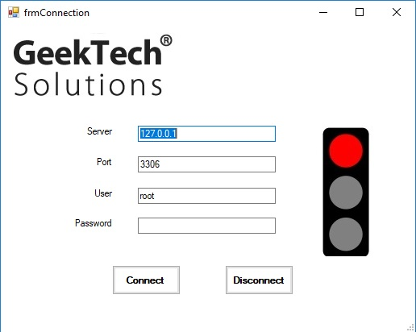
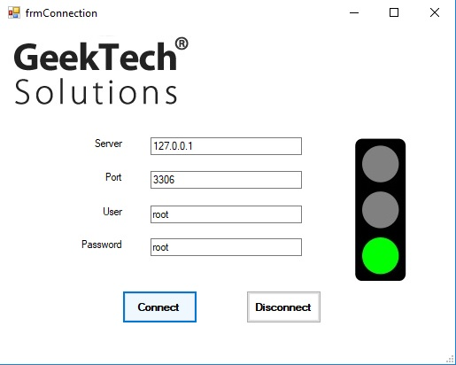
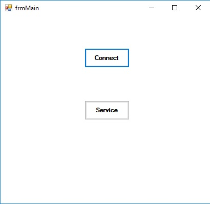
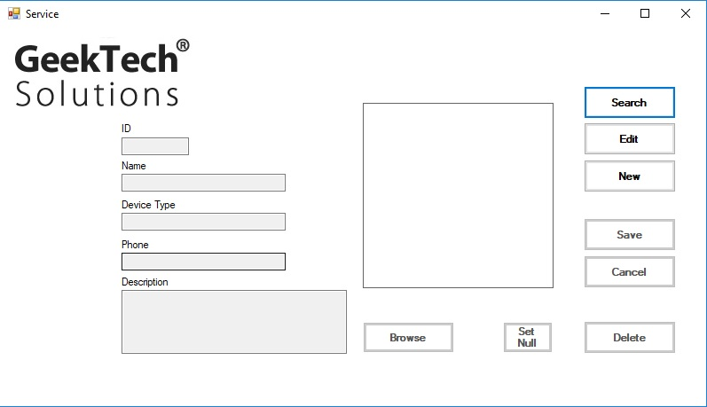
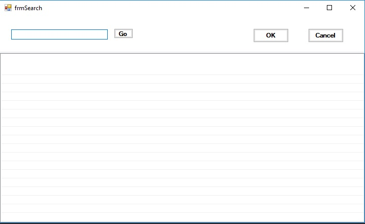
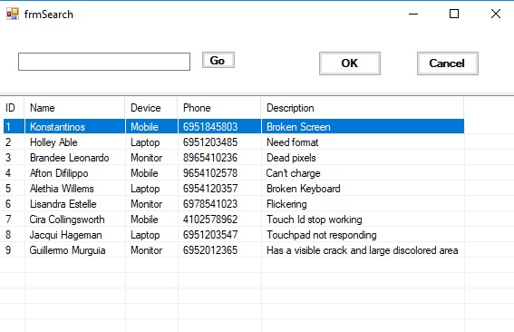
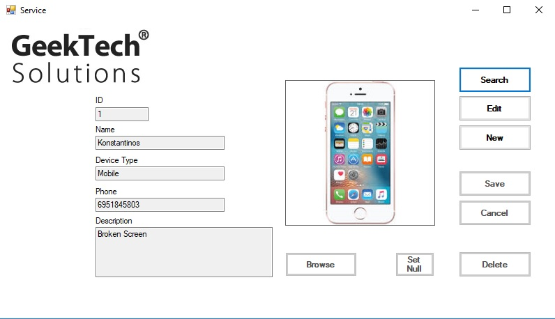

# CustomerService

## Customer Service App C#

It's a customer service app builded in C# that can read data from the database.
I used MySQL ODBC Drivers (MySQL ODBC Connector/ODBC is a standardized database driver for Windows, Linux, Mac OS X, and Unix platforms)
I also have some extra features to be mentioned below

### Guide

1. drop the project into the source\repos folder
2. import the database to your database management system that you can find in the DB folder
3. Open the Solution with the Visual Studio 
4. And that's it.

When you start the App the first form that you will see is the connection form.
You must fill the fields with the appropriate informations. 

When you fill all the fields correctly you will ready to connect to your database.

When you will connect successfully, close the form and you will see the next form that it's,
the main form of the App which you can choose the service to start.

When you will get into the service mode you will see all the informations you need about the customer and the problem that he has.
Here we have some extra features such as:

* Search
* Edit
* New
* Save
* Cancel
* Delete
* Set Null the photo
* Browse

Then you can create the customer or you can search for a customer to edit or delete him.

And here you have all the information about the customer that you have searched.

